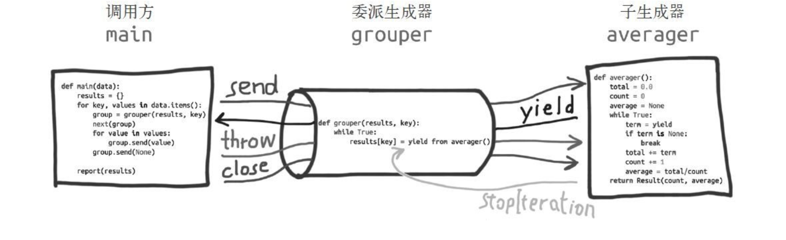

# Python 并发

> ​ [asyncio 在 python3.5 中如何工作](https://snarky.ca/how-the-heck-does-async-await-work-in-python-3-5/)
>
> ​ [深入理解 python 异步编程](https://mp.weixin.qq.com/s?__biz=MzIxMjY5NTE0MA==&mid=2247483720&idx=1&sn=f016c06ddd17765fd50b705fed64429c)
>
> ​ [深入理解 Python 异步编程](https://mp.weixin.qq.com/s?__biz=MjM5MzgyODQxMQ==&mid=2650370139&idx=1&sn=e4402260d852facb6f3d33ec20ed2be5&chksm=be9ccb0f89eb4219d986b1f15347f226a726f0da34aecbd593c0f61038e65f48d5334aeb2ca3&mpshare=1&scene=1&srcid=&pass_ticket=gLwNW%2BUgDzD3eMKuOQblqsLb05KdJis8nSFBCKEJffXeWuJIDpxEUQiUkGl74q2y#rd)
>
> ​[Python 协程技术演进](https://segmentfault.com/a/1190000012291369)
>
> 同步: 发出一个调用时, 没有得到结果前, 该调用就不返回.
>
> 异步: 发出调用后, 调用直接返回, 所以没有返回结果.
>
> 阻塞: 调用结果返回前, 当前线程被挂起, 调用线程只有在得到结果之后才返回.
>
> 非阻塞: 得到结果前, 调用不会阻塞当前线程.

## 1.多线程

> GIL：Global Interpreter Lock，全局解释器锁，语言解释器用于同步线程的一种机制，使得任何时刻仅有一个线程。
>
> cPython 中依靠 GIL，防止多个本地线程执行 Python 字节码；GIL 就是一个防止多线程执行机器码的 Mutex；及时有多核 CPU，当同时两个线程被调用时，由于锁的存在，只能有一个线程被执行；
>
> Python 的多线程在多核 CPU 上，只对 IO 密集型计算产生正面效果，对于 CPU 密集型多线程效率会大幅下降；
>
> python 虚拟机工作方式: 1.设置 GIL, 2.切换进一个线程运行, 3.执行字节码,(或让出控制权), 4.把线程设置回睡眠状态(切出线程), 5 解锁 GIL, 6.重复上述
>
> 当调用扩展外部代码时, GIL 会保持锁定, 直到函数执行结束;(因为没有 Python 字节码计数)

### 1.基本使用法式

- 使用`t = threading.Thread(target=function, name='threadName)`创建 Thread 对象，将函数同线程绑定；
- 用`t.start()`启动，用`join()`等待；
- 线程的执行内容: `Thread.run()`方法,该方法会调用参数`target`, 可以重写该方法;

### 2.守护线程

- python 主线程是在所有非守护线程退出后才会退出;
- 如果主线程退出时, 不需要等待某些子线程完成, 就可以为这些子线程设置守护线程标志;
- 当存在非守护线程未终止时, 进程不会退出;

### 3.local()

- 很多时候线程需要有自己的私有数据, 但是, 使用局部变量又带来使用上的不方便, 所以引入`threading.local()`;
- 全局声明, 但是每个线程都会有自己的实例,互不影响;

### 4.同步

- 锁:
  - 通过`lock = threading.Lock()`创建一个锁，
  - 通过`lock.acquire()`加锁，通过`lock.release()`释放；acquire :获得。
- 信号量:
  - 通过`sp = threading.Semaphore(N)`创建;
  - 通过`lock.acquire()`获取，通过`lock.release()`释放；超过数量获取会阻塞; 默认初始值为 1, 当`release`后, 现有值加一, 允许超过初始值;
  - 相关联: `BoundedSemaphore()`, 大致同`Semaphore`, 区别`release`不允许超过初始值; 否则会抛出`ValueError`异常;

### 5 其他

- `threading.current_thread()`: 返回当前线程对象;
- `threading.enumerate()`: 返回所有线程列表;

## 2.多进程

- 利用系统原生`fork()`

  - `fork()`：通过`os.fork()`创建进程，同`fork()`一致，父进程中返回子进程 ID，子进程返回 0；

- 利用`multiprocessing`模块

  - `multiprocessing`提供了了`Process`类来代表一个进程对象；适用方式：先创建对象，start 方法，join 方法，

- 进程间通信：`multiprocessing`中的`Queue, Pipes`等；
- `Pool()` ：用于创建大量的子进程；

- Demo:

  ```python
  from multiprocessing import Process
  import os

  # 子进程要执行的代码
  def run_proc(name):
      print('Run child process %s (%s)...' % (name, os.getpid()))

  if __name__=='__main__':
      print('Parent process %s.' % os.getpid())
      p = Process(target=run_proc, args=('test',))
      print('Child process will start.')
      # start()方法启动（创建子进程，去执行指定函数）
      p.start()
      # join()方法等待子进程结束，类似wait()或线程中的join
      p.join()
      print('Child process end.')
  ```

## 3.协程

> `yield`: 从单词字面意思理解: 产出, 让步.
>
> python 中, `yield item`产出一个值, 提供给`next()`调用方, 同时, 还会做出让步, 暂停执行生成器, 让调用方继续工作.
>
> 后来, `yield`还扩展了: 1.通过`.send()`向生成器发送信息; 2.通过`.throw(...)`让调用方抛出异常, 在生成器中处理; 3.通过`.close()`终止生成器. 此时, `yield`可以看做是一种流程控制的方式.
>
> 为了方便将生成器链接, 产生了`yield form`.
>
> 最终, 为了将协程和生成器区分, 引入`async def, await`等语法.

### 1.实现协程, 我们需要什么

> 协程的演进可以参考: [PEP342--通过生成器实现协程](https://www.python.org/dev/peps/pep-0342/) [PEP380--委托子生成器的语法](https://www.python.org/dev/peps/pep-0380/) [PEP492--async 和 await 协程语法](https://www.python.org/dev/peps/pep-0492/)

#### 1.生成器计算平均值

```python
def averager():
  total = 0.0
  count = 0
  average = None
  while True:
    term = yield average
    total += term
    count += 1
    average = total/count

# 创建协程对象
>>> coro_avg = averager()
# 预激协程
>>> next(coro_avg)
# 发送数据, 计算平均值
>>> coro_avg.send(10)
10.0
>>> coro_avg.send(30)
20.0
```

- 生成器协程目前存在的问题:
  - 需要预激.
  - 协程终止抛出`StopIteration`, 终止后的返回值只能放在异常中带出.
  - 仅服务于调用方. 不能像一般函数那样使用(每层都需要处理异常, 停止, 生成值等一系列问题).

#### 2.yield from

> yield from 的主要作用: 打开双向通道, 把最外层的调用方与最内层的子生成器连接起来, 自动传递值和异常.
>
> 术语定义:
>
> 1.委派生成器: 包含`yield from <iterable>`表达式的生成器函数;
>
> 2.子生成器: 从`<iterable>`捕获的生成器.



- `yield form`的意义:
  - 1.子生成器产出的值都直接传给委派生成器的调用方(客户端代码)
  - 2.使用`send()`方法发送给委派生成器的值都直接传递给子生成器.
  - 3.生成器退出, 返回值放入`StopIteration`中抛出.
  - 4.`yield from`表达式的值是子生成器终止时传给`StopIteration`异常的参数.
  - 通俗讲, 就是屏蔽生成器需要的特殊代码, 使得生成器协程能够像一般函数一样方便调用.

```python
RESULT = yield from EXPR

# 语义上等效于
# https://www.python.org/dev/peps/pep-0380/
_i = iter(EXPR)
try:
    _y = next(_i)
except StopIteration as _e:
    _r = _e.value
else:
    while 1:
        try:
            _s = yield _y
        except GeneratorExit as _e:
            try:
                _m = _i.close
            except AttributeError:
                pass
            else:
                _m()
            raise _e
        except BaseException as _e:
            _x = sys.exc_info()
            try:
                _m = _i.throw
            except AttributeError:
                raise _e
            else:
                try:
                    _y = _m(*_x)
                except StopIteration as _e:
                    _r = _e.value
                    break
        else:
            try:
                if _s is None:
                    _y = next(_i)
                else:
                    _y = _i.send(_s)
            except StopIteration as _e:
                _r = _e.value
                break
RESULT = _r
```

#### 3.新的协程语法

> 原有的协程语法还存在许多缺点: 1.由于语法通用, 协程和生成器之间容易混淆; 2.函数是否是协程是由是否含有`yield, yield from`语句决定, 都是依靠`def`定义, 无法同普通函数区分, 维护困难; 3.对协程调用依赖`yield`语句, 无法使用类似`with, for`等语句;
>
> [PEP492](https://www.python.org/dev/peps/pep-0492/)引入新的语法来定义和使用协程;

- 协程函数: `async def`

  - 定义协程函数, 即使函数内部不包含`await`表达式;
  - 调用后, 返回协程对象`<coroutine object>`;

- Coroutine objects 协程对象(一般说协程, 指的就是协程对象):

  - 可以通过`inspect.iscoroutine()`判断是否为协程对象;
  - 具有`.throw(), .send(), .close()`方法;

- Future-like object:

  - 具有`__await__`方法, 可以被`await`表达式使用.

- 等待表达式: `await EXPR`:

  - 暂停当前函数执行, 并等待可等待对象返回结果;
  - 可等待对象: 1.协程对象(由协程函数返回); 2.具有`__await__`方法的`Future-like object`;

- 异步上下文管理器: `async with`:

  - 在`enter`和`exit`方法中挂起执行(`await`)的上下文管理器;
  - 增加`__aenter__, __aexit__`方法, 两者返回一个可等待对象;

- 异步迭代器: `async for`:
  - 异步可迭代对象, 实现`__aiter__`, 返回异步迭代对象;
  - 异步迭代对象, 实现`__anext__`方法, 调用时返回可等待对象;
  - `__anext__`停止时抛出`StopAsyncIteration`异常;

### 2.asyncio

#### 1.低层级 API

##### 1.事件循环

> `asyncio`应用的核心. 一个进程中最多存在一个事件循环;
>
> 事件循环本身是一个死循环, 直到抛出异常, 或者设置 stop 标志才会停止.

- 当前进程的事件循环, 存储在`_running_loop`中, 事件循环启动时将自身(`self`)存储其中, 退出时清空;

  - 可以通过`get_running_loop(), get_event_loop(), set_event_loop(), new_event_loop()` 控制当前进程中的事件循环.

- 关键属性:
  - `._scheduled`: 被调度任务集, 最小堆, 方便取最小值;
  - `._ready`: 双向链表, 已准备就绪, 可以被执行的任务, 当`._ready`非空时, `slector`超时时间会被设置为0, 被立刻调用.
  - `._current_handle`: 当前执行任务.

- 添加任务:
  - `call_at(), call_later()`: 在某个时刻或者延时指定时间调用, 实例化一个`TimerHandle`, 放入调度堆中.
  - `call_son()`: 立刻调度, 实例化一个`Handle`, 放入`.ready`中.

- 整体流程:
  - 1.使用`select`, 将延时调度任务的最小时间作为超时时间
  - 2.如果超时或`select`中时间被触发, 遍历`_scheduled`, 将可执行任务加入`_ready`;
  - 3.遍历`_ready`, 执行.

- `Handle`: 被调度的基本单位
  - 包含上下文, 回调, 参数, 时间循环等信息.
  - `_cancelled`: 取消执行的标记;
  - `_run()`: 在指定的上下环境中, 执行回调.

##### 2.Futures

> 用来链接底层回调式代码 和高层异步/等待式代码. **代表一个异步运算的最终结果, 线程不安全**

- 相关函数:

  - `isfuture(obj)`: `Future`实例, `Task`实例, `._asyncio_future_blocking`属性的对象.

- `Future`对象属性和方法:
  - 状态: `PENDING, CANCELLED, FINISHED`;
  - `.result()`: 返回结果, 状态必须为`FINISHED`;
  - `.set_result()`: 状态更新为`FINISHED`, 设置返回结果, 调用回调函数;
  - `.done()`: future 是否完成, (状态为`FINISHED, CANCELLED`);
  - `.add_done_callback()`: 设置完成回调;
  - `._asyncio_future_blocking`
    - `await`表达式中: `Future`未完成, 置为`True`, 并`yield self`;
    - 在任务的`.__step()`中, 根据`_asyncio_future_blocking`判定执行流程.

##### 3.事件循环策略

> 策略是进程的全局对象, 管理事件循环, 决定事件循环的类型, 控制事件循环的产生.

- 事件循环策略存储在全局对象:`_event_loop_policy`中.

- 事件循环策略通过 `get_event_loop(), set_event_loop(), new_event_loop()`控制实现循环.

- 进程监视器
  - 进程监视器允许定制事件循环如何监视 Unix 子进程(就是知道子进程何时退出).
  - `ThreadedChildWatcher`: 为每一个子进程启动一个新的等待线程. 效率高, 但是占用而外内存.
  - `MultiLoopChildWatcher`: 注册`SIGCHLD`信号处理.

#### 2.协程和任务

##### 1.协程

- 协程函数定义:`async def func()...`
- 协程函数内部,能够使用`await, async for, aysnc with`等协程语法.
- 调用协程函数返回一个协程对象`<coroutine object>`;
- 协程的执行:
  - `asyncio.run(coro_fun())`
  - `await coro_fun()`;
  - `asyncio.create_task()`: 用于并发运行多个协程, (调用当前进程的事件循环的`create_task`方法)

#### 2.可等待对象

> 可以在`await`语句中使用, 就是可等待对象. 主要有: 协程对象, Task, Future

#### 3.Task

> 用于并发的执行协程. 协程通过`asyncio.create_task()`被打包为一个*任务*, 该协程自动排入日程, 并准备立即执行.
>
> 事件循环使用协同日程调度, 一个事件循环每次运行一个 Task 对象, 而一个 Task 对象会等待一个 Future 对象完成. 该时间循环会运行其他 Task, 回调或 IO 操作.

- 通过`asyncio.create_task()`将一个协程对象打包为一个任务, 返回一个`Task`对象, 该协程将自动排入日程准备立即运行;

- 全局对象

  - `_all_tasks`: 所有 task 集合;
  - `_current_tasks`: 每个`loop`对应的正在执行的 task.

- `Task`对象:

  > A coroutine wrapped in a Future.
  >
  > 继承于 Future

  - 关键属性方法:
    - `._fut_waiter`: 用于存放协程执行的返回.
    - `._step()`: 通过`coro.send(None)`, 驱动协程执行.
    - `._wakeup()`:

  - 实例化时, 将`.__setp()`放入事件循环的`._ready`中(立刻调用).

#### 4.并发运行任务

- `asyncio.gather(*aws)`: 并发运行`aws`序列中的可等待对象;
- `asyncio.wait_for(aw, timeout)`: 超时等待.
- `asyncio.as_completed(aws)`: 并发执行可等待对象, 返回一个`Future`对象的迭代器.

  - `asyncio.run(async_function(xx))`: 运行传入的协程对象;

    - 底层通过获取事件循环, 调用`loop.run_until_complete()`执行;

  - `await async_function()`: 等待一个协程执行;

  - `await task`: 等待一个任务执行;

  - **并发执行**: `asyncio.gather(*aws, loop=None, return_exceptions=False)`:

    - `aws`: 可等待对象;

    - ```python
        async def test(name, number):
            await asyncio.sleep(number)
            print('Task %s ok!' % name)

        async def main():
            await asyncio.gater(
              test('A', 4),
                test('B', 3),
                test('C', 2),
                test('D', 1),
            )
      ```

- **超时等待**

  - `asyncio.wait_for(aw, timeout)`: 返回一个可等待对象, 指定时间后超时;
  - `asyncio.wait(aws, timeout, return)`: 返回协程, 并发等待, 可以设置超时和返回条件;

### 4.协程框架使用

- `aiohttp`:

  ```python
  import aiohttp

  async with aiohttp.ClientSession() as session:
      async with session.get('http://xxxxx') as response:
          print(response.status)
          print(await response.text())
  ```

## 4.concurrent.futures

> 启动并行任务, 异步执行可以由`ThreadPoolExecutor`或`ProcessPoolExecutor`来实现

## 扩展: yield 的实现原理

### 1.python 虚拟机的执行流程

- 通过栈帧对象`PyFrameObject`抽象出运行时（栈，指令，符号表，常量表等），通过执行`PyEval_EvalFrameEx` 这个 C 级别的函数来逐个解析字节码指令; 可调用对象都是通过 `PyEval_EvalFrameEx`来执行自己的`PyFrameObject`的

- 以**栈帧**(`PyFrameObject`)为基本单位, 形成一个栈帧链, 执行的时候在这些栈帧链中进行切换; 链表的表头就是当前的运行栈;
- 在 python 中, 一个模块, 类以及函数的执行都会产生一个**栈帧**;

### 2.generator 的实现

- generator 的主要实现原理就是保存了当前的栈帧(栈帧中同样记录着当前执行到哪条字节码指令);
- 切换过程: 1.保存当前过程的执行栈(把栈内容`memcpy`到堆中), 2.恢复目标子过程的执行栈, 并恢复栈顶的状态继续执行;
