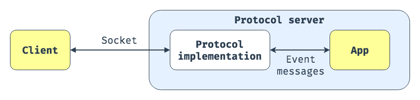

# Python 网络编程

## 1.WSGI

> WSGI: Python Web Server Gateway Interface, 为Python语言定义的**Web服务器**和**Web应用程序或框架**之间的一种简单而通用的接口规范`application(environ, start_response)`.
>
> WSGI服务器负责生成环境信息, 调用指定的接口app, 并传入`environ`环境信息, `start_response`回调对象, 并接受返回值
>
> [参考](https://www.python.org/dev/peps/pep-3333/)

- 应用程序必须接受两个位置参数;

  - `environ`: 字典对象, 包含 CGI 风格的环境变量, 还必须包含WSGI所需的环境变量;

  - `start_response(status, response_headers, exc_info=None)`: 接受两个参数的可调用对象, 用于发送响应头部信息.
- `status`: 字符串, 响应状态;
    - `response_headers`: 格式为`[(head, head_value)]`, list 类型, 元素为包含头部和信息的`tupe`,
    - `exc_info`: 异常信息;
    - `start_response('200 OK', [('Content-Type', 'text/html')])`
  
- `application`必须返回一个可迭代对象, 产生 0 个或多个`byts`类型,

- python 中的简单测试

  ```python
  from wsgiref.simple_server import WSGIServer, WSGIRequestHandler

  def application(environ, start_response):
      status = '200 OK'
      response_headers = [('Content-type', 'text/plain')]
      start_response(status, response_headers)
      return [b'hello']

  # 配置服务器
  server = WSGIServer(('0.0.0.0', 80), WSGIRequestHandler)
  server.set_app(application)
  
  # 启动服务器, 当监听到连接时, 通过`_handle_request_noblock()`处理, 该函数内部通过 一系列调用, 最后会实例化RequestHandlerClass, ReqestHandlerClass初始化时会执行handle方法 对于WSGI, WSGIRequsestHandler().handle();
server.server_forever()
  
    def handle(self):
        handler = ServerHandler(
            self.rfile, self.wfile, self.get_stderr(), self.get_environ())
        handler.request_handler = self      # backpointer for logging
        handler.run(self.server.get_app())
    
    def run(self, application):
        # 生成environ环境信息
        self.setup_environ()
        # 调用指定的application, 传入回调函数 start_response
        self.result = application(self.environ, self.start_response)
        # 处理返回,响应请求
        self.finish_response()
    
    # 接受status, headers, 将数据写入data (HTTTP协议的头部信息)
    def start_response(sefl, starus, handers):
      pass
  ```

## 2.ASGI

> `Asynchronous Serve Gateway Interface`:  Django团队提出的一种具有异步功能的服务器网关接口协议, 网络协议服务器(特别是**Web服务器**)和**Python应用程序之间的标准接口**, 允许处理**多种通用协议(HTTP, HTTP/2, WebSocket)**.
>
> `ASGI`
>
> [参考](https://asgi.readthedocs.io/en/latest/index.html)

### 1.对比wsgi

- `WSGI`是**单个可调用的同步应用程序**, 它接受请求并返回响应, 不允许使用轮询`HTTP`或者`WebSocket`连接.

- `ASGI`允许随时从不够用的应用程序线程或进程发送和接收数据, 提供`HTTP/2`和`WebSocket`代码的方法.

    - 接口形式就是一个异步可调用结构, `coroutine application(scope, receive, send)`

    - 允许应用程序是一个异步函数`async def`;

    - 包含一个连接的详细信息`scope`;

    - 应用向客户端发送消息的异步可调用对象`send`;

    - 应用从客户端接收消息的异步可调用对象`receive`;

        ```python
        # asgi 应用程序示例
        async def application(scope, receive, seed):
            event = await receive()
            ...
            await send({"type": "websocket.send"})
        ```

### 2.规格

- ASGI组成:
  
  - **协议服务器**: 将套接字转换为事件消息. 例如`Uvicorn, Daphne`
  - **应用程序**: 驻留在协议服务器中, 每个连接中实例化一次, 在事件消息发生时对其进行处理.
  
  
  
- 事件`Events`: ASGI将协议分解为多个事件, 应用程序针对事件作出反应.
  
  - http协议: `http.request, http.disconnect`
  - websocket协议: `websocket.connect, websocket.send, websocket.receive, websocket.disconnect`
  
- 接口形式:
  
  - 单个异步调用: `coroutine application(scope, receive, send)`:
    - `scope`: 字典, 连接范围信息 `{'type': 'http', 'path': '请求目标', 'method': 'GET', }`
    - `receive`: 用于接收ASGI事件消息的异步函数.
    - `send`:  用于发送ASGI事件消息的异步函数.
  
  - 每个连接调用`application`一次, 连接寿命由具体的协议规定.

### 3.实现

- 服务器实现: `Daphne`, `Uvicorn`, `Hypercorn`
- 应用框架: `Django/Channels`, `FastAPI`, 

## 3.socket

### 1.流程

### 2.常用设置

- `sock.settimeout()`: 阻塞套接字的操作设置超时.
- `sock.setsockopt(socket.IPPROTO_TCP, socket.TCP_NODELAY, 1)`: 禁用Nagle算法(包的缓存)
- `sock.setsockopt(socket.SOL_SOCKET, socket.SO_KEEPALIVE, 1)`: 开启TCP的keepalive.

### 3.socketpair

- 构建一对已经连接的套接字对象, 

- ```python
    s1, s2 = socket.socketpair()
    ```

- 

## 4.selectors / select 等待 I/O 完成

> selectors: 高级 I/O 复用库.
>
> select: 提供了对`select(), poll(), epoll()`等函数的访问.

- `selectors.DefaultSelector()`: 默认的 selector, 使用当前平台可使用的最有效的实现(epoll>poll>select).
- `selectors.SelectSelector()`: 基于`select`的 selector.
- `selectors.PollSelector()`: 基于`poll`的 selector.
- `selectors.EpollSelector()`: 基于`epoll`的 selector.
- 三者都继承于抽象类`BaseSelector`:
  - `register()`: 注册某个文件的某个事件;
  - `select()`: 执行监控, 知道触发监控对象的指定事件. 返回`(key, events)`

```python
import selectors
import socket

def accept(sock, mask):
    conn, addr = sock.accept()  # Should be ready
    print('accepted', conn, 'from', addr)
    conn.setblocking(False)
    sel.register(conn, selectors.EVENT_READ, read)

def read(conn, mask):
    data = conn.recv(1000)  # Should be ready
    if data:
        print('echoing', repr(data), 'to', conn)
        conn.send(data)  # Hope it won't block
    else:
        print('closing', conn)
        sel.unregister(conn)
        conn.close()

# 默认 selector
sel = selectors.DefaultSelector()

# 监听 1234端口
sock = socket.socket()
sock.bind(('localhost', 1234))
sock.listen(100)
# 非阻塞
sock.setblocking(False)

# 对 sock 注册可读事件, 回调为 accept
sel.register(sock, selectors.EVENT_READ, accept)

while True:
    events = sel.select()
    for key, mask in events:
        callback = key.data
        callback(key.fileobj, mask)
```

- 低等级模块:
  - `select.epoll()`: 返回一个`edge poll`对象, 该对象可作为 I/O 事件的边缘触发或水平触发接口.
  - `select.poll()`: 返回一个`poll`对象, 该对象支持注册和注销文件描述符, 支持对描述符进行轮询以获取 I/O 事件.
  - `select.select()`: `Unix select`系统调用的直接接口.

