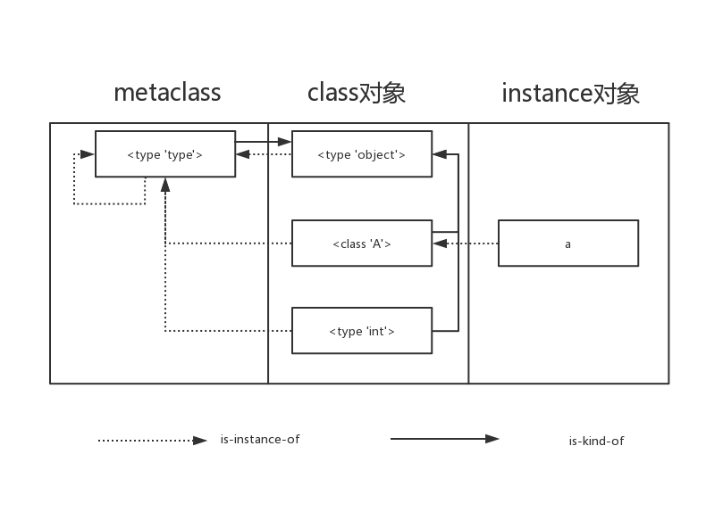

# Python 语言基础

## 1.词法分析

- 编码声明: 位于 Python 脚本的第一或第二行, 匹配`coding=xx`中指定的编码格式, 推荐写法: `# -*- coding: <encoding-name> -*-`

- 特殊标识符:
  - `_*`: 不会被`from module import *`导入.
  - `_`: 在交换模式中, 保存最近一次的求值结果, 不处于交换模式时, 无特殊含义.
  - `__*__`: 具有特定含义或作用的属性和方法(魔术方法).
  - `__*`: 类的私有名称.

## 2.数据类型

### 1.数据类型基础

- 基本数据类型：`int, float, str, bool, NoneType`
- 容器：`list, str, tuple, dict, set`等;

### 2.`str`

- `s = r'\temp\spam'`：Raw 字符串, 忽略转义; 注意，`\`不能出现在最后一位
- `r_s = s[::-1]`：逆序；
- `.replace('pa', 'xxx')`：替换；
- `.startswith()`: 判断开始字符; 参数可以为`tuple`, 表示为其中之一;
- `.join(s)`：用自身分割；
- `.split(',')`：用字符分割，返回列表；
- `s * 2`：重复
- 字符串存在编码方式的问题，详见第 9 章：编码方式；

### 3.`list`

> Python 的`list`实现是长度可变数组(指数过分配), 插入和删除元素消耗较高(O(n)). 如果需要真正意义上的链表结构, 可以使用`collections.deque`;

- `.append(value)`：附加单个元素到 list 的尾部；
- `.extend([xx, xx])`：附加列表到元素尾部；--> 等同于 `list_a = list_a + list_b`
- `.remove(value)`：移除第一非匹配到的元素；
- 列表是可变对象，可以原处修改；
- 遍历删除或添加列表元素：
  - **直接遍历，当删除或增加列表元素时，列表长度发生变化，但遍历的长度不变。会产生问题！**
  - 推荐有此需求时，遍历列表的拷贝；

### 4.`dict`

- `key in d`：键存在测试；

- 关键方法:

  - `.keys()`：-->所有键；
  - `.values()`：所有值；
  - `.items()`：键值对元组；
  - `.get('key', default=None)`：获取一个键的值，不存在不会抛出异常，返回默认值；
  - `.update(xx_dict)`: 使用 dict 对象更新当前对象, 等价于`for k in E: D[k] = F[k]`

- `dict`的键:

  - 只有**可哈希的**对象才可以作为字典的键, 实现`__hash__(), __eq__()`两个方法;
  - 所有不可变类型都是可哈希的.
  - 一般用户自定义类型都是可哈希的.

- `dict`中的元素是无序的

  - 如果需要同时保留顺序性, 可以使用`collections.OrderdDict`.

- 弹性查询

  - `defaultdict`类型: 提供一个可调用方法, 当键找不到时, 通过可调用对象生成默认值.

- 扩展: 解决哈希冲突

  - 链接法: 映射到同一位置时,将同一位置的元素加入同一个链表.
  - 开放定址法: 映射到同一位置时, 重新寻找位置, 每个位置最多有一个元素;(**cPython 采用此方式**)

### 5.元组`tuple`

- 元组不可变，没有 list 的修改之类的方法；
- 元组拆包:

### 6.其他

- `None`：表示为空，一个特殊的对象，类型为`NoneType`，表示数据为空，对应的布尔值为`False`
- 数的表示: `0x`表示十六进制数, `0o`表示八进制数, `0b`表示二进制数.

## 3.运算符和语句

> 基本同 C 语言类似，存在特殊点；

### 1.基本语法

- 赋值：

```python
# 序列赋值：任何序列都可按位置赋值给变量
a, b = [1, 2]
a, *b = [1,2,3]
a, b = 1, 2

# 增强赋值语句：
# 对于列表，增强赋值语句相当于`list_a.extend(list_b)`，实际也会转换为`extend`调用；
a += 12

# 交换
a,b=b,a+b

```

- `**`：幂运算符号；
- `//`：取整除；
- `/` ：精确除（即使能够整除得到的也是浮点数）；
- `<<,>>` ：左移右移，会保留符号位；
- 逻辑运算：`and, or, not`
- `lambda表达式` ：`a = lambda x: x**2`
- python 条件判断：

  - 可以使用`10 < a < 20`: 相当于`10<a and a<20`
  - 优先级: 单目 > 双目 > 位运算 > `in, not in, is, is not` > 逻辑;

### 2.特殊语法

- 索引
  - 对于取位置元素的`a[-1]`, 可以使用负数, 表示倒数位置;
- `a<10<b<11`比较运算符可以任意串联
  - 等价于相连两个拆分后用`and`连接.

#### 1.列表生成式

- `[exp for iter_var in iterable]`列表生成式，生成新的`list`.

  ```python
    [i*i for i in range(10)]
    # 后面的for循环仅表示循环多少次。_ 常用于表示临时变量
    [random.choice(range(10)) for _ in range(9)]
  ```

#### 2.切片

> 为什么切片和区间会忽略最后一个元素?
>
> 1.当只有最后一个位置信息时, 可以快速看出切片和区间有多少元素.
>
> 2.结束位置和起始位置相减, 可以快速计算区间长度.

- 切片：`[start_index : end_index : step]`

  - `start_index`表示起始索引；
  - `end_index`表示结束索引；
  - `step`表示步长，步长不能为 0，且默认值为 1，为`-1`可以逆序切片；

- 切片的原理:
  - `data[key]`: 实际调用`__getitem__`方法实现, 参数为`key`.
  - `data[1:-1:2]`: 实际也是调用`__getitem__`方法, 参数为`slice(1, -1, 2)`
    - `slice(1, -1, 2).indices(len) --> (start, stop, step)`: 可以将负数转换为实际索引和步长.

- 给切片赋值:

  - 相当于对原有序列部分元素赋值.

- 将方括号转换为括号, 就变成了生成器.

#### 3.上下文管理

> with 语句会设置一个临时的上下文, 交给上下文管理器对象控制, 并负责清理上下文.

- `with`: 可作用于含有`__enter__(self)`, `__exit__(self, exc_type, exc_value, traceback)`的对象;
  - 执行过程: 调用`__enter__()`,任何返回值都会绑定到`as`子句 --> 执行代码块 --> 调用`__exit__()`;
  - `__exit__`参数, 整体类似(sys.):
    - `exc_type`:异常类
    - `exc_value`: 异常实例
    - `traceback`: 一个对象, 该对象封装在异常最初发生的地方的调用堆栈.
    > `sys.exc_info()`: 获取异常信息, 返回一个元组, (exc_type, exc_value, traceback)

- `contextlib`:
  - `@contextmanager`: 接受一个`generator`.
    - 在`__enter__`中: 返回`next(gen)`;
    - 在`__exit__`中: 1. 无异常, 调用`next(gen)`, 并捕获`StopIteration`; 2.如果有异常, 通过`gen.throw()`, 向生成器抛入异常.

  - `@closing`: 将对象转变为上下文对象. 在`with`结束时调用`close`方法.

  ```python
  @contextmanager
  def session_scope(maker):
    session = make()
    try:
        yield session
        session.commit()
    except:
        session.rollback()
        raise
    finally:
        session.close()
  ```

#### 4.特殊的else

- `for...else`: 在循环自然结束, 而不是循环过程中`break`退出的情况下执行, 可以用于清除哨兵变量等操作;
- `try...except...else...`: 未发生异常时执行.

## 4.对象模型

- **对象**: python 对数据的抽象, 每个对象都有各自的编号(类似地址), 类型和值.
- 对象被创建后, 编号就不会改变, 通过`id()`能够返回其编号(CPython 中就是对象的内存地址).
  - `is`运算符可以比较对象的编号是否相同;
  - `type()`返回对象的类型, 类型决定了对象支持的操作和可取值的范围.
  
- **可变对象和不可变对象**:
- **不可变对象**: 值不可改变, 对容器来说就是容器包含的对象集不可改变(_容器元素可变不代表容器可变_).
    - 不可变类型有: `int, str, tupl, bytes(字节串)`.
    - 容器不可变并不表示容器元素不可变, 例如`tupl`元素为`list`对象.
  - **可变类型**: `list, dict`等等;
  
- **变量**:

  - 是一个系统表的中的元素，拥有指向对象连接空间.
  - 或者说对象的一个引用.

- 引用, del和垃圾回收

  - 引用是一种关系，以内存中的指针的形式实现；
    - `sys.getrefcount()`会返回引用计数；
  - `del`: 删除的是名称, 而不是对象(减少引用计数)
  - `CPython`中, 垃圾回收使用的主要算法是引用计数;
  - 弱引用: `weakref`, 不会增加引用数量;

- **函数参数值传递**:

  - 首先要理解: **变量是对象的一个引用;**
  - 函数参数传递时, 本质上是赋值, 和**赋值操作本身就是一种名字到对象的绑定过程**;
  - 参数传递是赋值, 但是传入的实质是对象的引用;

- `==`和`is`:

  - `==`值比较，是否相同，
  - `is`精确比较，是否指向同一个对象；

- **is-kind-of, is-instance-of**



- 对象和类(或类型), 类和元类(type)之间存在`is-instance-of`的关系

  - 对象的类可以通过对象的`.__class__`属性, 或`type()`方法获取.
  - `isinstance()`判断对象是否为某个类的实例.
  - **`type`是自身的实例**.

- 父类(基类)和子类之间存在`is-kind-of`(算是一种)的关系.

  - 可以通过`issubclass()`判断.
  - 子类的`.__bases__`属性判断.
  - 所有元类都是`type`的之类, 所有的类都是`object`的子类.

- `type 和 object`

  - `object` 一切皆对象.
    - **`type`也是`object`的子类, type的实例--类也是object的实例**
    - **`type`也是`object`的子类, type是type的实例, 所以type(包括元类) 都是object的实例**
    - **普通类都 继承于object, 所以类的实例也是object的实例**
    - **`type`也是`object`的子类, `object`是`type`的实例, 所以`object`也是一个`object`**

  - 所有类(包括`type, object`)都是`type`的实例.
    - 类是type的实例.
    - object是type的实例.
    - type是type的实例.

- 赋值,深拷贝, 浅拷贝:
  - 赋值: 赋值语句**不会构造新对象**, 而是在目标和对象之间建立绑定关系;
    - `a=b`: 赋值前后的变量均为一个对象的引用.`id(a)`和`id(b)`一致.
  - 浅拷贝: `copy.copy(x)`, **先构造一个新对象**, 然后将原对象中找到的元素的引用插入其中;
    - 拷贝的是元素的引用.
  - 深拷贝: `copy.deepcopy()`, **构造一个新对象**, 递归地将原始对象中找到的对象的副本插入;
    - 拷贝的是元素的副本(深拷贝对象)
  - 常见操作的拷贝类型:
    - 浅拷贝: 列表切片, `.copy()`方法.
    - 深拷贝: `copy.deepcopy()`

## 5.迭代

### 1.迭代器

> 迭代过程:
>
> 1.解释器在需要迭代对象`x`时, 会自动调用`iter(x)`获取迭代器`it`;
>
> 2.不断在迭代器`it`上调用`next`函数, 获取下一个元素;
>
> 3.结束, 迭代器`it`抛出`StopIteration`异常.

- `iter(x)`实现:
  - 检查是否实现`__iter__`方法, 获取迭代器.
  - 当对象没有实现`__iter__`但是实现了`__getitem__`方法, 解释器会创建一个迭代器, 尝试按顺序(索引`0`)获取元素.
  - *类似: `in`运算符依靠`__contains__`方法, 当`__contains__`方法未实现时, 也会使用`__getitem__`.*

- 可迭代对象

  - 可迭代对象`collections.Iterable`: 可以直接作用于`for`循环的对象，包括`list, tuple, dict, set, str, generator, 迭代器, 生成器`等；可以用`isinstance(xxx, collections.Iterable)` 判断是否可迭代；
  - 可迭代对象需要实现`__iter__()` 方法，并返回一个迭代器；

- 迭代器
  - `__next__`: 返回下一个可用元素, 否则抛出`StopIteration`异常.
  - `__iter__`: 返回`self`(迭代器自身也可迭代).

- 生成器函数和`yield`:

  > 习惯上, 会将生成器函数名加上`gen`前缀或后缀, 表明函数是生成器函数

  - 函数体内使用了`yield`关键字.
  - 函数调用会产生一个生成器对象, 使用`next`调用生成器对象, 生成器会向前执行到下一个`yield`语句.
  - 状态挂起: 和返回值并退出的常规函数不同，生成器函数自动在生成值的时刻挂起并继续函数的执行。（在下次取值的时候才进行下次的运算）。

- `yield from`:
  - 生成器函数需要产出另一个生成器生成的值.

  ```python
  def chain1(*iterables):
    for it in iterables:
      for i in it:
        yield i

  def chain2(*iterables):
    for it in iterables:
      yield from it
  ```

- 迭代器和生成器：

  - 迭代器：任何实现了`__next__（）`方法 （python2 是 next）的对象都可以称为迭代器，同列表的区别在于，构建迭代器的时候，不像列表把所有元素一次性加载到内存，而是以一种延迟计算方式返回元素。
  - 生成器：生成器本身还是一个迭代器，可以理解为方便构造的特殊迭代器。
  - 生成器是单迭代器对象，只支持一次活跃迭代。

### 2.生成器

> 在`yield`表达式处暂停并返回数据,暂存函数内部数据和栈信息, 当再次使用`next`或`send`时继续执行;
>
> `send`: 发送一个参数到 generator, 该参数作物`yield`表达式的值,并返回下一个值;
>
> [参考](https://docs.python.org/3.7/reference/expressions.html#yieldexpr)

- 创造生成器的方式:

  - 1.使用列表生成器：将列表生成式的`[]`换为`()`，如`a = (i for i in range(10))` a 就是一个生成器；

  - 2.使用`yield`：

    ```python
    def test(max):
        a = 0
        while a < max:
            yield a
            a = a + 1
    ```

- 可以通过`for`循环或`next()`取出生成器中的数据, 每次取一个值, 最终抛出`StopIteration`的异常;4.yield 表达式

## 6.异常处理

> 在函数出错时，c 往往会通过返回值表示是否发生错误，这导致正确结果和错误代码混和，一旦出错，还要一级一级上报；所以一般高级语言通常都内置了一套`try...except...finally...`的错误处理机制；

### 1.异常处理

- `try`：来运行代码，如果发生错误，则后续代码不会继续执行，直接跳转到错误处理，即`except`语句块；

- `except`：如果没有发生错误，则此段不会执行；发生错误，会被此段捕获；

- `finally` ：如果有此段，则最后一定会执行(发生不发生异常都会执行), `try...finally`语句可用上下文管理替代；

- `raise`：抛出异常；

- 错误种类：错误也是`class`，所有错误类型都继承自`BaseException`，捕获时不但可以捕获指定类型，还能将子类型同时捕获；

- 可以通过继承`Exception`定义异常类；

  ```python
  try:
    pass
  except Exception1:
      # 存在指定异常时会被捕获
      pass
  except Exception2:
      pass
  else:
      # 未发生异常捕获时执行
      pass
  finally:
      # 必定执行，无论发生未发生异常
      pass
  ```

## 7.文本和字节序列

> 人类使用文本, 计算机使用字节序列.
>
> 编码: 把字符串变成用于存储或传输的字节序列就是编码.
>
> 解码: 把字节序列转换为人类可读的文本字符.

### 1.字符编码 [参考 1](https://www.zhihu.com/question/23374078/answer/69732605) [参考 2](http://www.ruanyifeng.com/blog/2007/10/ascii_unicode_and_utf-8.html)

- **ASCII**，（American Standard Code for Information Interchange，美国信息交换标准代码），用 8 个字节来表示字符，最高位为 0，共 127 个，用于表示英文字符和控制码；
- 扩展字符集：将 127 号后面的进行编码，添加特殊字符；
- 由于 ASCII 编码不能表示汉字，中国定制了`GB2312`编码；小于 127 的字符同 ASCII 码，两个大于 127 的字符连在一起，表示一个汉字；（原先`ACSII`中存在数字、标点、字母也重新进行了两字节编码，成为全角字符；原先`ASCII`中的叫半角字符）；
- **GBK**，对`GB2312`的扩展，包含`GB2312`的所有内容，同时又增加了近 20000 个新汉字和符号；汉字占两个字节；
- **Unicode**：对世界上大部分文字进行整理,编码,使得计算机可以使用更简单的方式处理文字. 通常用多个字节表示一个字符；会造成传输和存储的浪费；为解决浪费问题, 出现了 UTF-8，UTF-16, UTF-32 等编码方案；
- UTF-8，变长编码，使用 1~4 个字节表示一个符号；中文字符占 3 个字节（Unicode 占 2 个字节）；用 UTF-8 编码的文件会在打开时转为 Unicode 编码，保存和传输时还是 UTF-8 编码；
- 大小端:
  - 大端: 高位字节排放在内存的低地址端.
    - 符合人类阅读习惯: 先读到的(低地址位)是数据的高位.
  - 小端: 低位字节排放在内存的低地址端;
    - 符合计算机的运算方式: 先读到(低地址位)是数据的低位.

### 2.python 字符编码

- 在 python3 中，字符串是以 Unicode 编码的，`ord()`：获取字符的整数表示，`chr()`：把编码转换为字符；

  ```python
  # 下面内容等价
  '\u4e2d\u6587'
  '中文' --> Unicode 编码，每个中文占2个字节
  ```

- python3 中的字符串类型为`str`，当需要在网络上传输，或保存到硬盘上时，就要把`str`转为`bytes`(用带`b`的前缀的单引号或双引号表示 ) `b'abc'`;

- `str`的`encode()`方法可以编码为指定的 bytes；

- `bytes` 转为`str`用`decode()`方法；

## 8.文件 IO

- IO 操作面临异常情况，无法保证所有异常下，文件都得到关闭；可以使用`with`语句；

  - ```python
    with open('/path/to/file', 'r') as f:
        print(f.read())
    ```

- 像`open()`函数返回的这种有个`read()`方法的对象，在 Python 中统称为 file-like Object。除了 file 外，还可以是内存的字节流，网络流，自定义流等等。file-like Object 不要求从特定类继承，只要写个`read()`方法就行。

- `open()` 可以指定打开文件的编码方式`encoding`，默认 utf-8 编码；

- `b`：表示以二进制方式读写；

- ！！ ==调用`write()`写入文件时，并不会立刻写入，而是放入缓存中，等待空闲时写入；只有调用`close()`方法，才会立刻将未写入的数据写入磁盘；==

- 打开方式：`b`：可以处理二进制，`+`：同时为输入和输出打开，`r+、w+`：都是为读写打开，不同点`w+`当文件不存在时会创建，`w`也会创建；
- 文本文件，python 会转为常规`str`字符串，自动执行 Unicode 编码；
- 二进制文件会表示为一个特殊的`bytes`字符串类型，

## 9.Python2 和 Python3 不同点

- `print`语句
- 类, python2 是旧式类, 需要显式继承`object`, python3 是新式类;
- 字符串类型: python2 是`str, Unicode`, python3 是`bytes, str`;

- 除法结果: python2 中是整形, python3 中是浮点型;

