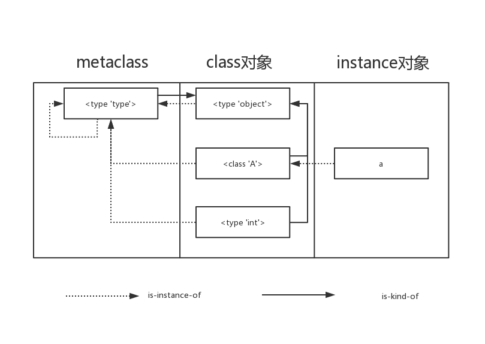

> 主要参考: [栖迟于一丘](https://www.hongweipeng.com/index.php/series.html), [CPython Internals](<https://github.com/rainyear/CPython-Internals-Lecture-Notes>), <<Python源码剖析>>, [Python/C API 参考手册](<https://docs.python.org/zh-cn/3/c-api/index.html>)
>
> 工具: [visualize](<http://www.pythontutor.com/visualize.html#mode=edit>)
>
> 主要源码文件:
>
> Include/, 相关头文件;
>
> Objects/, 定义Python内置类型;
>
> Python/, Python解释器运行时程序;

## 1.对象

> 对象的基础是类型`PyObject`, 包含引用计数和类型信息. 除此之外, 还需有空间表示对象的值. 一般对象的实现都是由类似`PyVarObject`这样的结构, 所有对象都可以强制转换为`PyObject`类型,  算是一种继承机制;
>


### 1.对象基础

```c
typedef struct _object {
    Py_ssize_t ob_refcnt;           /* 引用计数 */
    struct _typeobject *ob_type;    /* 类型 */
} PyObject;
```

- 引用计数: 
  - `ob_refcnt`记录了对象的引用计数;
  - 通过 `Py_INCREF(op)` 和`Py_DECREF(op)`可以增加和减少引用计数;
  - `Py_DECREF(op)`: 减少引用计数, 当引用计数减少到0时, 调用`op->tp_dealloc`函数, 销毁对象;
- 定长对象和变长对象:
  - 定长对象: 不同对象所占空间一致;
  - 变长对象: 不同对象所占空间不一致; 如`PyVarObject`, 会有记录数据空间大小的元素;

- 多态实现:
  - 对象的基础是`PyObject,` 所有Python对象, 都可以表示为一个`PyObject`类型, 然后在实际使用中根据 `ob_type`动态判断;
  - 

#### 1.类型

- ```c
    typedef struct _typeobject {
        PyObject_VAR_HEAD      /* 类型对象相关数据, 类型引用, 类型的类型等信息 */
        const char *tp_name;   /* 类型名 */
        /*  该类型实例的字节大小, tp_basicsize: 对象需要的基本大小, tp_itemsize: 元素大小 */
        Py_ssize_t tp_basicsize, tp_itemsize; 
    
        /* 析构函数, 当引用计数为零时, 由Py_DECREF()调用, 用于释放实例的空间, 最后调用类型的tp_free函数 */
        destructor tp_dealloc;
    
        // 结构体, 包含一系列的数的操作, 加减乘除等
        PyNumberMethods *tp_as_number;
        // 结构体, 包含一系列的可迭代对象的操作, 长度, 替换, 取元素等
        PySequenceMethods *tp_as_sequence;
        PyMappingMethods *tp_as_mapping;
        /* hash函数 */
        hashfunc tp_hash;
        /* 实现类型实例可调用 */
        ternaryfunc tp_call;
        /* 继承的基类 */
        PyObject *tp_base;
        /* 初始值NULL, 在PyType_Ready()中,  
        PyObject *tp_dict;
        ...
        // 对象销毁函数
        vectorcallfunc tp_vectorcall;
    } PyTypeObject;
    ```
    
- 类型对象永远不会被析构, **相同类型的对象的类型指向的是同一个类型对象**;

- `PyObject`通过`struct _typeobject *ob_type;`定义对象的类型, 指定类型名称, 基本操作等;

- 地址最前, 保存`PyObject_VAR_HEAD`, 是一个`PyVarObject`结构体, 表示类型也是一个对象;

    - 对象的类型(如`str`)作为一个对象, 也会有类型, 会指向`PyType_Type`;

    - `PyType_Type`既是一个对象, 又是一个类型,  其类型指向自身, 实现如下:

    - ```c
        /* typeobject.c */
        PyTypeObject PyType_Type = {
        	// 初始化类型对象 PyVarObject 相当于: { {引用计数=1, 类型->PyType_Type}, 长度=0}
            PyVarObject_HEAD_INIT(&PyType_Type, 0)
            // 类型名
            "type",
        }
        ```

- `PyTypeObject`包还含若干函数指针, 最终会指向对象的对应操作的函数或`null`;

    - 如数类型的操作加减乘除, 迭代类型的操作, 遍历, 查找, 替换, 取元素等;
    - 字符串方法: `tp_str`
    
- `tp_dealloc`和`tp_free`:

    - `tp_dealloc`: 析构函数
    - `tp_free`:低层级对象销毁函数, 一般会在`tp_dealloc`中被调用;

#### 2.对象创建

> 一般通过两种途径创建: 1.通过Python C API, 2.通过类型对象`PyInt_Type`;
>
> C API分为: 
>
> 	1. 泛型API(AOL), 形式为`PyObject_****`, 可以应用在任何Python对象上; 
>  	2. 与类型相关的API(COL), 通常只能作用在某一种类型上.
>
> 对象创建的一般步骤: 


### 2.内置类型

> 内置类型定义在"Objects"文件夹内, 

#### 1.整型

> ob_size: 绝对值表示需要的 ob_digit 个数, 负数: ob_size < 0, 零: ob_size == 0;
>
> ob_digit: 数值信息, 不含符号位, 长度由 ob_size决定, 符号由ob_size符号决定;

```c
// int 对象结构
struct _longobject {
    PyObject_VAR_HEAD
    digit ob_digit[1];
};
typedef struct _longobject PyLongObject;

// int 类型
PyTypeObject PyLong_Type = {
    PyVarObject_HEAD_INIT(&PyType_Type, 0)
    "int",                                      /* tp_name */
    // 结构成员相对于结构开头的字节偏移量, 整体对象需要空间
    offsetof(PyLongObject, ob_digit),           /* tp_basicsize */
    // 元素需要空间
    sizeof(digit),                              /* tp_itemsize */
    ...
    // 数学方法
    &long_as_number,                            /* tp_as_number */
    // 哈希方法
    (hashfunc)long_hash,                        /* tp_hash */
    Py_TPFLAGS_DEFAULT | Py_TPFLAGS_BASETYPE |
        Py_TPFLAGS_LONG_SUBCLASS,               /* tp_flags *

    long_new,                                   /* tp_new */
    PyObject_Del,                               /* tp_free */
};
```

- 空间申请: `_PyLong_New(size)`, 按照`PyLongObject`大小 + 指定数量的`digit` 申请空间;
- 数据储存: 数值15位位单位切割, 保存在一个`digit`中, `digit`为 2个字节, 最高位空出;
  - *为什么最高位空出*? 
    1. 相加时, 最高位保存进位;
    2. 相乘时, 结果可以保存到`long int`中;
- 关键函数:
  - 数学方法: 加减乘除, 会对运算进程优化, 例如乘法: 当`ob_size`均小于等于1时(结构可以存放在`long`或`long long`中), 直接相乘, 其余使用`Karatsuba `乘法;
  - 转为字符串: `long_to_decimal_string`;
  - 哈希函数: `long_hash`;
- python会将-5~256的小整数直接创建保存, 避免频繁申请回收, 保存在`static PyLongObject small_ints[NSMALLNEGINTS + NSMALLPOSINTS];`数组中;  通过`get_small_int()`直接获取小整数对象;

#### 2.str

> Python3到Python2的升级之一就是使用`Unicode`作为字符串;
>
> 

```c
// unicode字符串对象
typedef struct {
    PyCompactUnicodeObject _base;
    union {
        void *any;
        Py_UCS1 *latin1;
        Py_UCS2 *ucs2;
        Py_UCS4 *ucs4;
    } data;                     /* Canonical, smallest-form Unicode buffer */
} PyUnicodeObject;

PyTypeObject PyUnicode_Type = {
    PyVarObject_HEAD_INIT(&PyType_Type, 0)
    "str",                        /* tp_name */
    sizeof(PyUnicodeObject),      /* tp_basicsize */
    0,                            /* tp_itemsize */
    /* Slots */
    (destructor)unicode_dealloc,  /* tp_dealloc */
    0,                            /* tp_vectorcall_offset */
    0,                            /* tp_getattr */
    0,                            /* tp_setattr */
    0,                            /* tp_as_async */
    unicode_repr,                 /* tp_repr */
    &unicode_as_number,           /* tp_as_number */
    &unicode_as_sequence,         /* tp_as_sequence */
    &unicode_as_mapping,          /* tp_as_mapping */
    (hashfunc) unicode_hash,      /* tp_hash*/
    0,                            /* tp_call*/
    (reprfunc) unicode_str,       /* tp_str */
    PyObject_GenericGetAttr,      /* tp_getattro */
    0,                            /* tp_setattro */
    0,                            /* tp_as_buffer */
    Py_TPFLAGS_DEFAULT | Py_TPFLAGS_BASETYPE |
    Py_TPFLAGS_UNICODE_SUBCLASS,   /* tp_flags */
    unicode_doc,                  /* tp_doc */
    0,                            /* tp_traverse */
    0,                            /* tp_clear */
    PyUnicode_RichCompare,        /* tp_richcompare */
    0,                            /* tp_weaklistoffset */
    unicode_iter,                 /* tp_iter */
    0,                            /* tp_iternext */
    unicode_methods,              /* tp_methods */
    0,                            /* tp_members */
    0,                            /* tp_getset */
    &PyBaseObject_Type,           /* tp_base */
    0,                            /* tp_dict */
    0,                            /* tp_descr_get */
    0,                            /* tp_descr_set */
    0,                            /* tp_dictoffset */
    0,                            /* tp_init */
    0,                            /* tp_alloc */
    unicode_new,                  /* tp_new */
    PyObject_Del,                 /* tp_free */
};
```

#### 3.List

> `PyListObject`, 实现方式是数组, 会预先申请一部分内存

```c
// list对象
typedef struct {
    PyObject_VAR_HEAD
        
    /* 指向PyObject数组的指针 */
    PyObject **ob_item;

    /* allocated:申请的总空间,  ob_size 表示当前已使用空间(len()获取的值) */
    Py_ssize_t allocated;
} PyListObject;

PyTypeObject PyList_Type = {
    PyVarObject_HEAD_INIT(&PyType_Type, 0)
    "list",
    // 需要申请的object的空间大小
    sizeof(PyListObject),
    // 列表对象析构函数
    (destructor)list_dealloc,                   /* tp_dealloc */
	// 迭代相关函数
    &list_as_sequence,                          /* tp_as_sequence */
    
    PyType_GenericAlloc,                        /* tp_alloc */
    PyType_GenericNew,                          /* tp_new */
    // 释放空间函数
    PyObject_GC_Del,                            /* tp_free */
};
```

- `PyListObject`对象创建:
  - 只能通过`PyList_New()`函数创建;
  - 需要申请两部分内存: 1.`PyListObject`本身, 2.`ob_item`指向的内存;
  - 实际数组(*`ob_item`指向的内存*)中存放的是元素的指针;
  - `PyListObject`自身内存空间申请, 会先使用`free_list[PyList_MAXFREELIST]`缓冲池中的对象,  以减少`malloc`和`free`的调用, 如果缓存已用完, 再使用`ob_type->tp_basicsize`大小, 申请空间; 

- `PyListObject`对象销毁:
  - 变量销毁`ob_item`中的元素, 然后释放`ob_item`指向的空间;
  - 如果`free_list[]`未满, 则将药销毁的`PyListObject`加入列表(静态变量`numfree`记录数据中当前元素数量);
  - 如果`free_list[]`已满, 则调用`tp_free`释放空间;
- `list`对象方法:
  - `append`: 实现是`PyList_Append()`:
    - 首先会进行**合法性判断**, 然后判定是否需要**重新申请空间**, 最后增加被添加对象的**引用计数**, 并将值**添加**到尾端;
    - `ob_item`指向的空间会按照类似`new_allocated = newsize + (newsize >> 3) + (newsize < 9 ? 3 : 6);`的策略进行预分配;
  - `insert`: 实现是`PyList_Insert()`:
    - 1.按照`ob_size+1`调整大小, 2.插入位置后的元素后移, 3.插入元素;
  - `remove`: 实现是`list_remove()`:
    - 1.遍历数组, 跟需要remove的元素比较; 2.如果找到相等的元素, 移除,
    - **元素比较**: 1. 先比对地址, 如果相同, 直接返回, 2.执行富比较(类型一致, 类型允许富比较(`tp_richcopare != NULL` );
  - `切片`: 
    - 1.计算切出的长度, 创建新的列表, 2.遍历, 拷贝数据到新列表;
- **注意点**:
  - `list`元素个数由`ob_size`存储, 大小由其类型限制, 所以存在容量限制;

#### 4.Dict

> 基于哈希表, 冲突解决方式为: **开放寻址**;
>
> 哈希表空间结构:
>
> ```c
> +---------------+
> | dk_indices    | --> 存放 索引, DKIX_EMPTY, DKIX_DUMMY; (DKIX_EMPTY=-1, DKIX_DUMMY=-2)
> | -   -   -   - |
> | x,x,x,x,x,x,x |
> +---------------+
> | dk_entries    | --> PyDictKeyEntry 的数组
> | -   -   -   - |
> |PyDictKeyEntry,|
> |PyDictKeyEntry,|
> |PyDictKeyEntry,|
> |PyDictKeyEntry,|
> +---------------+
> 
> ```
>
> 1. `dk_size`: 哈希表的大小, `dk_indices`中索引的总个数;
> 2. 索引类型是根据` dk_size`大小来确定,  以节省空间;
>
>  ```c
>     * int8  for          dk_size <= 128
>     * int16 for 256   <= dk_size <= 2**15
>     * int32 for 2**16 <= dk_size <= 2**31
>     * int64 for 2**32 <= dk_size
>  ```
>
> 2. `dk_entries`大小由`USABLE_FRACTION(dk_size)`控制(哈希表的稀疏程度);
> 3. `DK_ENTRIES(dk)`用于获取`dk_entries`的指针;

```c
// dict
typedef struct {
    PyObject_HEAD
    // 已使用 item 数量
    Py_ssize_t ma_used;
    // 全局唯一, 每次修改字典都会更改
    uint64_t ma_version_tag;
    PyDictKeysObject *ma_keys;
    // 如果 ma_values==NULL, key和value在ma_keys; 否则分别存储
    PyObject **ma_values;
} PyDictObject;

// PyDictKeyEntry 是存放在哈希表中的元素信息 
typedef struct {
    // me_hash, me_key的哈希值
    Py_hash_t me_hash;
    PyObject *me_key;
    // 仅对组合表有意义
    PyObject *me_value;
} PyDictKeyEntry;

// key对象的定义, PyDictKeysObject, typedef struct _dictkeysobject PyDictKeysObject;
struct _dictkeysobject {
    Py_ssize_t dk_refcnt;
    // 哈希表(dk_indices)的大小, 2的整数倍
    Py_ssize_t dk_size;
    // key查找函数
    dict_lookup_func dk_lookup;
    // dk_entries 可使用条目数, 不足需要申请
    Py_ssize_t dk_usable;
    // dk_entries 已使用条目数
    Py_ssize_t dk_nentries;
    // 哈希表
    char dk_indices[];
};

PyTypeObject PyDict_Type = {
    PyVarObject_HEAD_INIT(&PyType_Type, 0)
    "dict",
    sizeof(PyDictObject),
    0,
    (destructor)dict_dealloc,                   /* tp_dealloc */
    0,                                          /* tp_vectorcall_offset */
    0,                                          /* tp_getattr */
    0,                                          /* tp_setattr */
    0,                                          /* tp_as_async */
    (reprfunc)dict_repr,                        /* tp_repr */
    0,                                          /* tp_as_number */
    &dict_as_sequence,                          /* tp_as_sequence */
    &dict_as_mapping,                           /* tp_as_mapping */
    PyObject_HashNotImplemented,                /* tp_hash */
    0,                                          /* tp_call */
    0,                                          /* tp_str */
    PyObject_GenericGetAttr,                    /* tp_getattro */
    0,                                          /* tp_setattro */
    0,                                          /* tp_as_buffer */
    Py_TPFLAGS_DEFAULT | Py_TPFLAGS_HAVE_GC |
        Py_TPFLAGS_BASETYPE | Py_TPFLAGS_DICT_SUBCLASS,         /* tp_flags */
    dictionary_doc,                             /* tp_doc */
    dict_traverse,                              /* tp_traverse */
    dict_tp_clear,                              /* tp_clear */
    dict_richcompare,                           /* tp_richcompare */
    0,                                          /* tp_weaklistoffset */
    (getiterfunc)dict_iter,                     /* tp_iter */
    0,                                          /* tp_iternext */
    mapp_methods,                               /* tp_methods */
    0,                                          /* tp_members */
    0,                                          /* tp_getset */
    0,                                          /* tp_base */
    0,                                          /* tp_dict */
    0,                                          /* tp_descr_get */
    0,                                          /* tp_descr_set */
    0,                                          /* tp_dictoffset */
    dict_init,                                  /* tp_init */
    PyType_GenericAlloc,                        /* tp_alloc */
    dict_new,                                   /* tp_new */
    PyObject_GC_Del,                            /* tp_free */
};
```

- `PyDictObject`对象的创建, `PyDict_New()`:
    - 首先尝试获取未释放的对象,  没有, 则新申请`PyDictObject`对象`mp`;
    - 初始化`mp->ma_keys, mp->ma_values`,  `ma_keys`会被初始化为一个`empty_keys_struct`, 增加全局计数;
- 元素搜索: `PyDict_GetItem`
    - 1.计算`key`的hash值; 2.调用`ma_keys->dk_lookup()`
- 元素插入:
    - 1.适用`dk_lookup`查找, 2.如果`dk_usable<=0`, 重新申请空间;   
- `pydict_global_version`: 全局计数;

## 2.程序执行

> python如何运行程序: 
>
> 1. 将源码编译成字节码, 编译是一个简单的翻译的步骤,  字节码可以提高执行速度. 
> 2. 如果具有写权限, 将把程序的字节码保存为一个以`.pyc`为扩展名的文件. 
> 3. 如果机器上有字节码, python会直接加载字节码并跳过编译步骤; **如果无写权限, 字节码会丢弃, 所以尽量保证大型程序可以写入**.
> 4. 字节码发送到**Python虚拟机(PVM)**上执行, 由虚拟机一条一条地执行字节码, **PVM**就是迭代运行字节码指令的大循环.

### 1.pyc文件, PyCodeObject对象和字节码

> **pyc文件** : python对程序编译的结果是生成一个`.pyc`文件, 实质是`PyCodeObject`对象, `pyc`文件只是`PyCodeObject`对象在硬盘上的表现形式; 
>
> **PyCodeObject对象**: 会存储**变量名**信息, 字节码信息, 
>
> 解释器通过`PyMarshal_WriteObjectToFile`写入pyc文件, 通过`PyMarshal_ReadObjectFromFile`加载pyc文件;
>
 ```c
// 字节码对象, 包含 字节码, 变量名, 文件名等信息;
typedef struct {
    PyObject_HEAD
    int co_argcount;            /* 位置参数的个数 */
    int co_nlocals;             /* 局部变量个数, 包括位置参数 */
    int co_stacksize;           /* 堆栈需要空间 */
    int co_flags;               
    int co_firstlineno;         /* 第一行源码的行号 */
    PyObject *co_code;          /* 字节码指令序列 */
    PyObject *co_names;         /* 所有的符号 */
    PyObject *co_consts;        /* list, 使用到的常量 */
    PyObject *co_varnames;      /* tuple, 局部变量名 */
    PyObject *co_freevars;      /* tuple, 嵌套作用域中 变量名 集合 内层函数属性*/
    PyObject *co_cellvars;      /* tuple, 嵌套作用域中 变量名 集合 外层函数属性*/
    ...
} PyCodeObject;
 ```

- 如何获得`code`对象?

    1. 使用`compile()`编译得到, 例如`compile(source, 'file.py', 'exec')`;

    2. 函数的`__code__`属性;

- 字节码(Bytecode): 包含指令(如`LOAD_CONST`)和操作数,  指令定义在`opcode.h`中;

    - 通过` opcode = _Py_OPCODE(word)`取出指令;

    - 通过`oparg = _Py_OPARG(word);`取出操作数;

    - ```c
          1   0 LOAD_CONST           0 (<code object foo at 0x7faf650778a0, file "test.py", line 1>)
              2 LOAD_CONST           1 ('foo')
              4 MAKE_FUNCTION        0
              6 STORE_NAME           0 (foo)
        
          5   8 LOAD_NAME            0 (foo)
             10 LOAD_CONST           2 ('hello')
             12 CALL_FUNCTION        1
             14 POP_TOP
             16 LOAD_CONST           3 (None)
             18 RETURN_VALUE
      ```

    - PVM根据指令做出相应操作:`switch(){case...}`

- 字节码的查看:

    - 通过`python3 -m dis file.py`也可以查看相应字节码指令;
    - `dis.dis(co)`, 查看`PyCodeObject`对象的字节码信息;

- `co_freevars 和 co_cellvars`:

  - `co_freevars `: 在嵌套函数中, 用于**内层函数**保存**外层嵌套**作用域中的变量;

  - `co_cellvars `: 在嵌套函数中, 用于**外层函数**保存**内层嵌套**作用域中的变量;

  - ```python
    def get_func():
        x = 1
        def inner_func():
            return x
    get_func.__code__.co_cellvars == ('x',)
    get_func().__code__.co_freevars == ('x',)
    ```

### 2.PVM Python虚拟机

> PVM从PyCodeObject对象中依次读入每一条字节码, 并在当前上下文环境中执行, `PyFrameObject`对象; 就是PVM对执行环境的抽象(**变量名和值信息**);

#### 1.栈帧的抽象:`PyFrameObject`

- 实现:

    - ```c
        typedef struct _frame {
            PyObject_VAR_HEAD           /* 本身是一个变长对象 */
            struct _frame *f_back;      /* 执行环境的上一个frame, 形成链表结构 */
            PyCodeObject *f_code;       /* 指向对应的字节码对象 */
            PyObject *f_builtins;       /* builtin symbol table (PyDictObject) */
            PyObject *f_globals;        /* global symbol table (PyDictObject) */
            PyObject *f_locals;         /* local symbol table (any mapping) */
            PyObject **f_valuestack;    /* 指向最后一个本地变量后, 栈开始处 */
            PyObject **f_stacktop;      /* 运行栈的栈顶 初始化时 == f_valuestack */
            PyObject *f_trace;          /* 异常时调用的句柄 */
            
            int f_lasti;                // 上一条字节码指令在f_code中的偏移位置
            int f_lineno;               // 当前字节码对应的源代码行
            int f_iblock;               // 当前指令在栈f_blockstack中的索引
            PyObject *f_localsplus[1];  // locals+stack, 动态大小, 维护(局部变量+运行时栈)所需要的空间 */
            ...
        } PyFrameObject;
        
        /* PyFrameObject 的模拟栈结构 */
         +===============+
         | PyFrameObject |
         +===============+
         | 其他属性       |
         +---------------+ <---- f_localsplus
         | locals        |  =--> 局部变量, 嵌套作用域中的变量 信息
         |---------------+ <---- f_valuestack 栈底
         | stack         |  =--> 栈信息
         +---------------+ <---- f_stacktop 栈顶
         | ...           |
         +---------------+
        ```

- 关联的栈帧由`f_back`形成链表结构;

- `f_localsplus`空间包含**栈空间** 和 **局部变量空间(局部变量+闭包内变量)**:

    - `locals`部分的空间大小由`code->co_nlocals + ncells + nfrees`决定;
    - `f_localsplus`空间 = `locals`空间 + `code->co_stacksize(栈空间大小)`

- 栈帧的创建: `_PyFrame_New_NoTrack(tstate, code, globals, locals)`

    1. 申请空间或从`free_list`中取出闲置frame; 申请空间大小需附加额外空间`extras = code->co_stacksize + code->co_nlocals + ncells + nfrees`;
    2. 初始化`f_code, f_globals, f_locals, f_builtins`;
    3. 将frame插入链表;

- 可以通过`sys._getframe()`访问当前的frame;

#### 2.作用域和名字空间

> python名字查找顺序 LEGB: 本地作用域 -> 闭包作用域 -> 全局作用域 -> 内建
>
> 属性: 本质也是名称查找, 只是不使用LEGB, 而是在对象的名字空间查找;

- 名称查找: **在当前所在frame**, 按照以下顺序查找:
    1.  `frame->f_locals`(包含局部变量和嵌套函数间的变量)
    2.  `frame->f_globals`
    3.  `frame->f_builtin`
- `frame->f_locals`包含: `co_varnames, co_freevars, co_cellvars`中的变量;
- 全局变量的传递:
    - `(创建时的frame)f->f_globals` ---函数定义--> `(函数对象)op->func_globals ` ---函数调用-->  `(函数调用的frame)f->f_globals` ;
- 闭包变量的传递:
    - `(创建时的frame)f->f_locals` ---放入栈中--> `(函数对象)op->func_closure` --函数调用--> `(函数调用的frame)f->f_localsplus + co->co_nlocals`
- 局部变量:
    - `f->f_localsplus`


#### 3.PVM运行框架

> PVM的具体实现就是 `PyEval_EvalFrameEx `函数, 内容就是执行进程对象的`eval_frame()`方法; 
>
> 虚拟机是对CPU的抽象, 运行过程就是遍历`PyCodeObject`对象的`co_code`字节码, 并执行指令的过程;

```c
PyObject *
PyEval_EvalFrameEx(PyFrameObject *f, int throwflag)
{
 PyInterpreterState *interp = _PyInterpreterState_GET_UNSAFE(); /* 找到进程对象 */
 return interp->eval_frame(f, throwflag);                       /* 执行进程对象的 eval_frame */
}

/* eval_frame 一般会被初始化为 _PyEval_EvalFrameDefault */
/* interp->eval_frame = _PyEval_EvalFrameDefault, 调用的是_PyEval_EvalFrameDefault() */

/* _PyEval_EvalFrameDefault 就是一个遍历字节码并执行的过程 */
PyObject* _Py_HOT_FUNCTION
_PyEval_EvalFrameDefault(PyFrameObject *f, int throwflag)
{    
    PyObject **stack_pointer;        /* Next free slot in value stack */
    const _Py_CODEUNIT *next_instr;  /* 指向下一条待执行字节码指令位置, 类似PC指针 */
    int opcode;                      /* 指令 */
    int oparg;                       /* 操作码 */
    PyCodeObject *co;
    PyThreadState * const tstate = _PyRuntimeState_GetThreadState(runtime); /* 获取当前活动线程 */
    ...
    tstate->frame = f;              /* 将 frame 赋予 当前活动线程;
main_loop:
    for (;;) {
fast_next_opcode:                    /* 每条指令执行成功, 跳到此处 */
        ...
        switch (opcode) {            /* 根据操作码作出相应操作 */
                case xxx {
                    ...;
                    goto fast_next_opcode
                }
                ...
    }
}
```


#### 4.PVM异常控制

-   出现异常, 会将异常信息记录在`PyThreadState `的`curexc_*`属性中; 然后`goto error`;

### 3.函数对象和函数调用

> `PyFunctionObject`是对python代码在运行时动态产生的,  在执行`def`语句是创建; 

#### 1.函数对象

- ```c
  typedef struct {
      PyObject_HEAD               /* 本身也是一个对象 */
      PyObject *func_code;        /* code对象, 对应函数对象的__code__ 属性 */
      PyObject *func_globals;     /* 全局变量, 对应函数对象的__global__属性 */
      PyObject *func_defaults;    /* 元祖, 默认参数, 对应函数对象的__defaults__属性*/
      PyObject *func_kwdefaults;  /* NULL or a dict */
      PyObject *func_closure;     /* 外层嵌套作用域中的信息, 对应函数对象的__closure__属性 */
      ...
      vectorcallfunc vectorcall;
  ...
  } PyFunctionObject;
  ```

- `func_globals`: **对应Python中函数对象的`__globals__`属性**, 指向所在`frame->f_global`, 当`frame->f_global`发生变化, `__global__`也可以感知到;

- Python在执行`def`语句时, 会在`MAKE_FUNCTION`指令过程中调用`PyFunction_NewWithQualName()`创建一个函数对象, :

  1. 申请空间;
  2. 初始化: 
      1. `op->func_code = code;` 在栈中记录
      2. ` op->func_globals = globals;` frame->f_globals
      3. ` op->func_name = ((PyCodeObject *)code)->co_name;` 栈中记录
      4. ` op->vectorcall = _PyFunction_Vectorcall;`
  
-  函数的名字空间:

    - 函数定义时记录当前`PyFrameObject`的`f_globals`信息,;
    - 函数被调用时, 调用过程中创建的`PyFrameObject`会获得函数对象中记录的`func_globals`;

#### 2.函数调用

```c
main_loop:
...
case TARGET(CALL_FUNCTION): {
    PREDICTED(CALL_FUNCTION);
	PyObject **sp, *res;
	sp = stack_pointer;       						/* 获取栈顶地址 */
	res = call_function(tstate, &sp, oparg, NULL);	/* 执行调用 */
	...
}
...
```

- 将函数压栈, 将参数压栈, 通过`CALL_FUNCTION`指令调用函数`call_function`;
- `call_function`:
  - 内联函数, 减少 堆栈使用;
  - 从栈中获取函数对象(由栈顶地址`sp`和参数个数`oparg`获取)和参数信息, 调用`PyFunctionObject->vectorcall`;
  - `vectorcall`在函数创建是被初始化为`_PyFunction_Vectorcall`
  - `_PyFunction_Vectorcall()`: 先创建`frame`信息, 最终调用`PyEval_EvalFrameEx()`
- 函数对象类型: `tp_vectorcall_offset = offsetof(PyFunctionObject, vectorcall)`
- 函数调用过程中变量的使用:
  - 全局作用域变量: 由`f_globals`中获取;
  - 闭包作用域变量: 由`f->f_localsplus`和操作数(偏移量)获取;
  - 局部作用域变量:`f->f_localsplus + co->co_nlocals`和操作数(偏移量)获取;

#### 3.闭包

> 闭包通过函数嵌套完成, 相关属相有`co_freevars,co_cellvars`

-   嵌套作用域中的信息存储: 

    -   函数创建时, 通过特殊操作数`oparg & 0x08`, 存储嵌套作用域空间数据到函数对象;

    -   ```c
        // 内存函数的创建
        case TARGET(MAKE_FUNCTION): {
            // 创建 PyFunctionObject 
            PyFunctionObject *func = (PyFunctionObject *)
                PyFunction_NewWithQualName(codeobj, f->f_globals, qualname);
            // 如果是创建内层函数, 取出 嵌套区域名称空间 赋值给 内层函数对象的 func_closure
            if (oparg & 0x08) {
                assert(PyTuple_CheckExact(TOP()));
                func ->func_closure = POP();
            }
        }
        ```

-   嵌套作用域中信息的使用:

    -   从函数对象中取出相关信息: `closure = func->func_closure;`
    -   将信息拷贝到`frame`的`f->f_localsplus + co->co_nlocals`的位置;
    -   使用时, 使用`freevar = f->f_localsplus + co->co_nlocals;`记录内存位置, 通过**操作数(偏移量)**查到具体的变量信息;
    -   每次内层函数调用, 都会将函数对象的`func_closure`拷贝到栈帧中, 即使多次调用, 栈帧中的嵌套作用域变量均指向同一个对象, 所以, 信息可以保留;

    -   ```c
         +---------------+ <---- f_localsplus        -+
         | locals        |                             \
         | - - - - - - - + <--- freevar                 +---> 局部变量和嵌套作用域中的变量信息
         |   closure     |                             /
         |               |                            /     
         |---------------+ <---- f_valuestack 栈底  -+
         | stack         |   <-- 栈信息                      
         +---------------+ <---- f_stacktop 栈顶        
         | ...           |                                    
         +---------------+                                 
         
         /*       由函数对象拷贝到frame       */
        freevars = f->f_localsplus + co->co_nlocals;           // 记录内存的起始位置
        for (i = 0; i < PyTuple_GET_SIZE(co->co_freevars); ++i) {
            PyObject *o = PyTuple_GET_ITEM(closure, i);
            Py_INCREF(o);
            freevars[PyTuple_GET_SIZE(co->co_cellvars) + i] = o; // 拷贝进行到内存中
        }
        
         /*       由frame中取出     */
        freevars = f->f_localsplus + co->co_nlocals;          // 记录内存的起始位置
        PyObject *cell = freevars[oparg];                     // 根据偏移取出对象
        PyObject *value = PyCell_GET(cell);                   // 取值
        ```
    


### 4.运行环境

> `PyInterpreterState`是对进程的抽象, `PyThreadState`是对线程的抽象;  解释器通过进程,线程,栈帧的模拟, 形成完整的运行环境. 三者通过指针形成关系.
>
> 通常, python仅有一个进程, 该进程中维护了一个或多个`PyThreadState`对象, 线程轮流使用一个`PVM`, 通过`PyThreadState_Swap`进行线程切换, 通过GIL实现同步;
>
> 可以通用`PyThreadState_GET()` 获取当前活动线程;

```c
     +---------------------+          +---------------------+
     | PyInterpreterState  |    +---->+ PyInterpreterState  |
     +---------------------+    |     +---------------------+
     | next                +----+     | next                +
     |                     |          |                     |
     | tstate_head         +----+     | tstate_head         +----+
     |                     |    |     |                     |    |
     +---------------------+    |     +---------------------+    |
 +------------------------------+                       +--------+
 |   +-----------------+    +---->+-----------------+   |    +-----------------+
 +-->+ PyThreadState   +<---|---+ | PyThreadState   +   +--->+ PyThreadState   |
     +-----------------+    |   | +-----------------+        +-----------------+
     | prev            |    |   +-+ prev            |        + prev            |
     | next            +----+     | next            +        | next            |
     | interp          |          | interp          |        | interp          |
     | frame           +----+     | frame           +---+    | frame           |
     |                 |    |     |                 |   |    |                 |
     +-----------------+    |     +-----------------+   |    +-----------------+
 +--------------------------+                           |
 |   +-----------------+         +-----------------+    |    +-----------------+
 +-->+ PyFrameObject   |    +--->+ PyFrameObject   |    +--->+ PyFrameObject   |
     |-----------------|    |    |-----------------|         |-----------------|
     | f_back          +----+    | f_back          |         | f_back          |
     | f_code          |         | f_code          |         | f_code          |
     | f_localsplus    |         | f_localsplus    |         | f_localsplus    |
     |                 |         |                 |         |                 |
     | ...             |         | ...             |         | ...             |
     +-----------------+         +-----------------+         +-----------------+

```

#### 1.runtime

```c
typedef struct pyruntimestate {
    /* 是否进行预初始化? 通过 Py_PreInitialize()  */
    int pre_initialized;
    /* 是否进行 Python core 初始化? 通过  _Py_InitializeCore()置1 */
    int core_initialized;
    /* 是否完成初始化, Set to 1 by Py_Initialize() */
    int initialized;

    PyThreadState *finalizing;

    struct pyinterpreters {
        PyThread_type_lock mutex;
        PyInterpreterState *head;  /* 记录进程表头 */
        PyInterpreterState *main;  /* 记录主进程 */
        int64_t next_id;           /* 下一个进程id, main进程id=0 */
    } interpreters;
    // XXX Remove this field once we have a tp_* slot.
    struct _xidregistry {
        PyThread_type_lock mutex;
        struct _xidregitem *head;
    } xidregistry;

    unsigned long main_thread;

#define NEXITFUNCS 32
    void (*exitfuncs[NEXITFUNCS])(void);
    int nexitfuncs;

    struct _gc_runtime_state gc;
    struct _ceval_runtime_state ceval;
    struct _gilstate_runtime_state gilstate;

    PyPreConfig preconfig;

    Py_OpenCodeHookFunction open_code_hook;
    void *open_code_userdata;
    _Py_AuditHookEntry *audit_hook_head;

    // XXX Consolidate globals found via the check-c-globals script.
} _PyRuntimeState;
```

#### 2.进程模拟

> 通常情况, python仅有一个进程

```c
typedef struct _is PyInterpreterState;
struct _is {

    struct _is *next;               /* 形成链表 */
    struct _ts *tstate_head;        /* 指向线程链表 */

    int64_t id;						/* 进程号 */
    int64_t id_refcount;
    _PyFrameEvalFunction eval_frame;  /* 默认是 _PyEval_EvalFrameDefault, 解释器主程序 */
    int requires_idref;
    PyThread_type_lock id_mutex;

    int finalizing;

    PyObject *modules;
    PyObject *modules_by_index;
    PyObject *sysdict;
    PyObject *builtins;
    PyObject *importlib;

    long num_threads;              /* 线程数 */
    ...
};

struct pyinterpreters {
    PyThread_type_lock mutex;
    PyInterpreterState *head;  /* 记录 PyInterpreterState 链表表头 */
    PyInterpreterState *main;  /* 记录 main interp */
    int64_t next_id;           /* 下一个可以分配的id */
} interpreters;                /* 存放在 interpreters = &runtime->interpreters */
```

-   进程环境初始化:`PyInterpreterState_New()`:
  
    1. 申请所需空间; 
    2. 设置`eval_frame`为`_PyEval_EvalFrameDefault`; 
    3. 通过`interpreters.next_id`设置进程id, 并将进程放入链表头; 
    4. 链表头由`interpreters->head`记录;
    5. 如果`interpreters->main`为空, 这记录当前进程为主进程;
    
    -   python程序运行: `pycore_create_interpreter()中`
    
-   

#### 3.线程模拟

```c
typedef struct _ts PyThreadState;
struct _ts {
    struct _ts *prev;
    struct _ts *next;            /* 形成双向链表结构 */
    PyInterpreterState *interp;  /* 指向所属进程 */

    struct _frame *frame;        /* 线程中的栈帧 */
    PyObject *curexc_type;       /* 异常类型 */
    PyObject *curexc_value;      /* 异常值 */
    PyObject *curexc_traceback;  /* */
    int gilstate_counter;        /* gil */
    ... 
    uint64_t id;                 /* 进程id */

};
```

- 线程环境创建通过`PyThreadState_New()`:
  - 1.申请空间;
  - 2.初始化线程数据: `interp`指向进程, 插入已有链表;
- 可以通过`PyThreadState_GET()`获取当前活动线程, 信息记录在运行时状态中;
- `PyThreadState_Swap()`: 将线程放入活动运行时活动线程, 返回上一个活动线程;
- 

## 3.类的实现

>   1.  Python中, 一切皆对象
>
>   2.  对象之间存在两种关系: `is-kind-of`, `is-instance-of`
>       1.  `is-kind-of`: 基类和子类之间的关系, 通过`issubclass`判断, 可以通过`__bases__`属性判断;
>       2.  `is-instance-of`: 类和实例之间的关系, 通过`isinstance`判断, 也可以通过对象的`__class__`属性和`type`方法探测;



-   `type`和`object`:
    -   任何一个对象都有一个type, 可以通过`__class__`属性获得;
    -   任何一个`class`对象都直接或间接与`<type ‘object’>`对象之间存在`is-kind-of`的关系;
-   可调用性: 只要实现了`__call__`操作, 就是可调用的对象. python中所谓的调用就是执行`type`所对应的`tp_call`;

### 1.PyType_Ready

-   用于初始化类信息;

-   ```c
    int PyType_Ready(PyTypeObject *type)
    {
        /* 1. Initialize tp_base (默认是object) */
        base = type->tp_base;
        if (base == NULL && type != &PyBaseObject_Type) {
            base = type->tp_base = &PyBaseObject_Type;
            Py_INCREF(base);
        }
        
        /* 2. Initialize tp_bases */
        bases = type->tp_bases;
        if (bases == NULL) {
            if (base == NULL)
                bases = PyTuple_New(0);
            else
                bases = PyTuple_Pack(1, base);
            if (bases == NULL)
                goto error;
            type->tp_bases = bases;
        }
    }
    ```

-   

## 4.模块加载


## I.C语言回顾

- **函数指针**: `void (*pf)(char *)`, `pf`是一个指向函数的指针, 函数需要一个`char *`参数, 返回`void`类型;

- 类型长度:

	| 类型          | 32位 | 64位 |
  | ------------- | ---- | ---- |
  | **char**      | 1    | 1    |
  | **short**     | 2    | 2    |
  | **int**       | 4    | 4    |
  | **long**      | 4    | 8    |
  | **long long** | 8    | 8    |
  | **float**     | 4    | 4    |
  | **double**    | 8    | 8    |
  | **point**     | 4    | 8    |

    